# System Architecture Analysis

## Overview

- **Project**: /home/tom/github/semcod/wupbro
- **Primary Language**: python
- **Languages**: python: 11, shell: 2, toml: 1, yaml: 1
- **Analysis Mode**: static
- **Total Functions**: 47
- **Total Classes**: 10
- **Modules**: 15
- **Entry Points**: 44

## Architecture by Module

### wupbro.notifications
- **Functions**: 15
- **Classes**: 1
- **File**: `notifications.py`

### wupbro.routers.notifications
- **Functions**: 10
- **File**: `notifications.py`

### wupbro.storage
- **Functions**: 8
- **Classes**: 1
- **File**: `storage.py`

### wupbro.routers.drivers
- **Functions**: 5
- **File**: `drivers.py`

### wupbro.routers.events
- **Functions**: 5
- **File**: `events.py`

### wupbro.routers.dashboard
- **Functions**: 2
- **File**: `dashboard.py`

### wupbro.__main__
- **Functions**: 1
- **File**: `__main__.py`

### wupbro.main
- **Functions**: 1
- **File**: `main.py`

### wupbro.models
- **Functions**: 0
- **Classes**: 8
- **File**: `models.py`

## Key Entry Points

Main execution flows into the system:

### wupbro.routers.notifications.notification_stream
> Server-Sent Events endpoint for real-time notifications.

Connect to this endpoint to receive notifications in real-time.
Requires active subscription
- **Calls**: router.get, Query, wupbro.notifications.get_notification_manager, manager.get_subscription, manager.register_sse_client, StreamingResponse, HTTPException, event_generator

### wupbro.routers.drivers.dom_diff_capture
> Trigger a one-shot DOM snapshot + diff against the previous snapshot.

Requires: `pip install wup playwright` and `playwright install chromium`.
- **Calls**: router.post, Depends, VisualDiffConfig, VisualDiffer, os.getcwd, differ.run_for_service, store.add, HTTPException

### wupbro.__main__.main
- **Calls**: argparse.ArgumentParser, parser.add_argument, parser.add_argument, parser.add_argument, parser.parse_args, uvicorn.run, os.environ.get, int

### wupbro.routers.drivers.browserless_screenshot
> Proxy to a `browserless/chrome` container.

Set BROWSERLESS_URL (default http://browserless:3000) for the upstream.
- **Calls**: router.post, os.environ.get, httpx.AsyncClient, HTTPException, resp.headers.get, len, HTTPException, client.post

### wupbro.routers.events.list_events
- **Calls**: router.get, Query, Query, Query, Depends, store.list, EventList, len

### wupbro.notifications.NotificationManager._detect_notification_types
> Detect which notification types apply to this event.
- **Calls**: detected.append, self._service_health.get, detected.append, detected.append, detected.append, detected.append, detected.append, detected.append

### wupbro.notifications.NotificationManager._create_payload
> Create notification payload for the given type and event.
- **Calls**: payloads.get, NotificationPayload, NotificationPayload, NotificationPayload, NotificationPayload, NotificationPayload, NotificationPayload, NotificationPayload

### wupbro.routers.events.post_event
- **Calls**: router.post, Depends, store.add, wupbro.notifications.get_notification_manager, notification_manager.process_event, notification_manager.push_to_sse, len

### wupbro.main.create_app
- **Calls**: FastAPI, app.add_middleware, app.include_router, app.include_router, app.include_router, app.include_router, app.get

### wupbro.notifications.NotificationManager.process_event
> Process event and generate notifications for matching subscriptions.

Returns list of (subscription_id, notification_payload) tuples.
- **Calls**: int, self._detect_notification_types, self._subscriptions.items, time.time, self._should_notify, self._create_payload, notifications.append

### wupbro.routers.notifications.subscribe
> Create a new notification subscription.

Returns subscription with unique ID that should be stored client-side
for subsequent requests.
- **Calls**: router.post, wupbro.notifications.get_notification_manager, manager.subscribe, str, NotificationConfig, uuid.uuid4

### wupbro.routers.notifications.send_test_notification
> Send a test notification to verify subscription works.

The notification will be queued and sent via SSE if client is connected.
- **Calls**: router.post, wupbro.notifications.get_notification_manager, manager.get_subscription, NotificationPayload, manager.push_to_sse, HTTPException

### wupbro.storage.EventStore._load_existing
- **Calls**: self.jsonl_path.exists, self.jsonl_path.open, line.strip, self.events.append, Event.model_validate_json

### wupbro.storage.EventStore.add
- **Calls**: self.events.append, id, self.jsonl_path.open, fh.write, event.model_dump_json

### wupbro.routers.drivers.anomaly_report
- **Calls**: router.post, Depends, store.add, Event

### wupbro.routers.notifications.get_subscription
> Get specific subscription details.
- **Calls**: router.get, wupbro.notifications.get_notification_manager, manager.get_subscription, HTTPException

### wupbro.routers.notifications.update_subscription
> Update notification configuration for existing subscription.
- **Calls**: router.put, wupbro.notifications.get_notification_manager, manager.update_config, HTTPException

### wupbro.routers.notifications.unsubscribe
> Remove notification subscription.
- **Calls**: router.delete, wupbro.notifications.get_notification_manager, manager.unsubscribe, HTTPException

### wupbro.storage.EventStore.__init__
- **Calls**: deque, threading.Lock, self.jsonl_path.parent.mkdir, self._load_existing

### wupbro.storage.EventStore.clear
- **Calls**: self.events.clear, self._seq_by_id.clear, self.jsonl_path.exists, self.jsonl_path.unlink

### wupbro.routers.events.event_stats
- **Calls**: router.get, Depends, store.stats

### wupbro.routers.events.clear_events
- **Calls**: router.delete, Depends, store.clear

### wupbro.routers.notifications.list_subscriptions
> List all active notification subscriptions.
- **Calls**: router.get, wupbro.notifications.get_notification_manager, manager.list_subscriptions

### wupbro.routers.drivers.driver_health
> Best-effort capability discovery.
- **Calls**: router.get, os.environ.get

### wupbro.routers.dashboard.root
- **Calls**: router.get, templates.TemplateResponse

### wupbro.routers.dashboard.dashboard
- **Calls**: router.get, templates.TemplateResponse

### wupbro.notifications.NotificationManager.__init__
- **Calls**: threading.Lock, defaultdict

### wupbro.notifications.NotificationManager.list_subscriptions
> List all active subscriptions.
- **Calls**: wupbro.storage.EventStore.list, self._subscriptions.values

### wupbro.notifications.NotificationManager.push_to_sse
> Push notification to all SSE clients.
- **Calls**: self._sse_queues.values, queue.append

### wupbro.routers.notifications.get_default_config
> Get default notification configuration.

Use this as template when creating custom configurations.
- **Calls**: router.get, NotificationConfig

## Process Flows

Key execution flows identified:

### Flow 1: notification_stream
```
notification_stream [wupbro.routers.notifications]
  └─ →> get_notification_manager
      └─ →> get_default_store
```

### Flow 2: dom_diff_capture
```
dom_diff_capture [wupbro.routers.drivers]
```

### Flow 3: main
```
main [wupbro.__main__]
```

### Flow 4: browserless_screenshot
```
browserless_screenshot [wupbro.routers.drivers]
```

### Flow 5: list_events
```
list_events [wupbro.routers.events]
```

### Flow 6: _detect_notification_types
```
_detect_notification_types [wupbro.notifications.NotificationManager]
```

### Flow 7: _create_payload
```
_create_payload [wupbro.notifications.NotificationManager]
```

### Flow 8: post_event
```
post_event [wupbro.routers.events]
  └─ →> get_notification_manager
      └─ →> get_default_store
```

### Flow 9: create_app
```
create_app [wupbro.main]
```

### Flow 10: process_event
```
process_event [wupbro.notifications.NotificationManager]
```

## Key Classes

### wupbro.notifications.NotificationManager
> Manages browser notification subscriptions and event detection.
- **Methods**: 13
- **Key Methods**: wupbro.notifications.NotificationManager.__init__, wupbro.notifications.NotificationManager.subscribe, wupbro.notifications.NotificationManager.unsubscribe, wupbro.notifications.NotificationManager.get_subscription, wupbro.notifications.NotificationManager.list_subscriptions, wupbro.notifications.NotificationManager.update_config, wupbro.notifications.NotificationManager.process_event, wupbro.notifications.NotificationManager._detect_notification_types, wupbro.notifications.NotificationManager._should_notify, wupbro.notifications.NotificationManager._create_payload

### wupbro.storage.EventStore
> Thread-safe ring buffer + JSONL persistence.
- **Methods**: 6
- **Key Methods**: wupbro.storage.EventStore.__init__, wupbro.storage.EventStore._load_existing, wupbro.storage.EventStore.add, wupbro.storage.EventStore.list, wupbro.storage.EventStore.clear, wupbro.storage.EventStore.stats

### wupbro.models.Event
> Generic WUP event posted by an agent.
- **Methods**: 0
- **Inherits**: BaseModel

### wupbro.models.EventList
- **Methods**: 0
- **Inherits**: BaseModel

### wupbro.models.DomDiffRequest
- **Methods**: 0
- **Inherits**: BaseModel

### wupbro.models.ScreenshotRequest
- **Methods**: 0
- **Inherits**: BaseModel

### wupbro.models.AnomalyReport
- **Methods**: 0
- **Inherits**: BaseModel

### wupbro.models.NotificationConfig
> Konfiguracja powiadomień przeglądarkowych dla użytkownika.
- **Methods**: 0
- **Inherits**: BaseModel

### wupbro.models.NotificationSubscription
> Subskrypcja powiadomień dla konkretnego klienta (przeglądarki).
- **Methods**: 0
- **Inherits**: BaseModel

### wupbro.models.NotificationPayload
> Payload wysyłany jako powiadomienie przeglądarkowe.
- **Methods**: 0
- **Inherits**: BaseModel

## Data Transformation Functions

Key functions that process and transform data:

### wupbro.notifications.NotificationManager.process_event
> Process event and generate notifications for matching subscriptions.

Returns list of (subscription_
- **Output to**: int, self._detect_notification_types, self._subscriptions.items, time.time, self._should_notify

## Behavioral Patterns

### recursion_list
- **Type**: recursion
- **Confidence**: 0.90
- **Functions**: wupbro.storage.EventStore.list

## Public API Surface

Functions exposed as public API (no underscore prefix):

- `wupbro.routers.notifications.notification_stream` - 14 calls
- `wupbro.routers.drivers.dom_diff_capture` - 13 calls
- `wupbro.__main__.main` - 9 calls
- `wupbro.routers.drivers.browserless_screenshot` - 8 calls
- `wupbro.routers.events.list_events` - 8 calls
- `wupbro.routers.events.post_event` - 7 calls
- `wupbro.main.create_app` - 7 calls
- `wupbro.notifications.NotificationManager.process_event` - 7 calls
- `wupbro.routers.notifications.subscribe` - 6 calls
- `wupbro.routers.notifications.send_test_notification` - 6 calls
- `wupbro.storage.EventStore.add` - 5 calls
- `wupbro.storage.EventStore.list` - 5 calls
- `wupbro.routers.drivers.anomaly_report` - 4 calls
- `wupbro.routers.notifications.get_subscription` - 4 calls
- `wupbro.routers.notifications.update_subscription` - 4 calls
- `wupbro.routers.notifications.unsubscribe` - 4 calls
- `wupbro.storage.EventStore.clear` - 4 calls
- `wupbro.routers.events.event_stats` - 3 calls
- `wupbro.routers.events.clear_events` - 3 calls
- `wupbro.routers.notifications.list_subscriptions` - 3 calls
- `wupbro.routers.drivers.driver_health` - 2 calls
- `wupbro.routers.dashboard.root` - 2 calls
- `wupbro.routers.dashboard.dashboard` - 2 calls
- `wupbro.notifications.NotificationManager.list_subscriptions` - 2 calls
- `wupbro.notifications.NotificationManager.push_to_sse` - 2 calls
- `wupbro.notifications.get_notification_manager` - 2 calls
- `wupbro.routers.notifications.get_default_config` - 2 calls
- `wupbro.storage.EventStore.stats` - 2 calls
- `wupbro.storage.get_default_store` - 2 calls
- `wupbro.notifications.NotificationManager.subscribe` - 1 calls
- `wupbro.notifications.NotificationManager.get_subscription` - 1 calls
- `wupbro.routers.notifications.get_notification_types` - 1 calls
- `wupbro.routers.notifications.get_status_transition_types` - 1 calls
- `wupbro.notifications.NotificationManager.unsubscribe` - 0 calls
- `wupbro.notifications.NotificationManager.update_config` - 0 calls
- `wupbro.notifications.NotificationManager.register_sse_client` - 0 calls
- `wupbro.notifications.NotificationManager.unregister_sse_client` - 0 calls
- `wupbro.notifications.set_notification_manager` - 0 calls
- `wupbro.storage.set_default_store` - 0 calls

## System Interactions

How components interact:

```mermaid
graph TD
    notification_stream --> get
    notification_stream --> Query
    notification_stream --> get_notification_man
    notification_stream --> get_subscription
    notification_stream --> register_sse_client
    dom_diff_capture --> post
    dom_diff_capture --> Depends
    dom_diff_capture --> VisualDiffConfig
    dom_diff_capture --> VisualDiffer
    dom_diff_capture --> getcwd
    main --> ArgumentParser
    main --> add_argument
    main --> parse_args
    browserless_screensh --> post
    browserless_screensh --> get
    browserless_screensh --> AsyncClient
    browserless_screensh --> HTTPException
    list_events --> get
    list_events --> Query
    list_events --> Depends
    _detect_notification --> append
    _detect_notification --> get
    _create_payload --> get
    _create_payload --> NotificationPayload
    post_event --> post
    post_event --> Depends
    post_event --> add
    post_event --> get_notification_man
    post_event --> process_event
    create_app --> FastAPI
```



## Reverse Engineering Guidelines

1. **Entry Points**: Start analysis from the entry points listed above
2. **Core Logic**: Focus on classes with many methods
3. **Data Flow**: Follow data transformation functions
4. **Process Flows**: Use the flow diagrams for execution paths
5. **API Surface**: Public API functions reveal the interface

## Context for LLM

Maintain the identified architectural patterns and public API surface when suggesting changes.